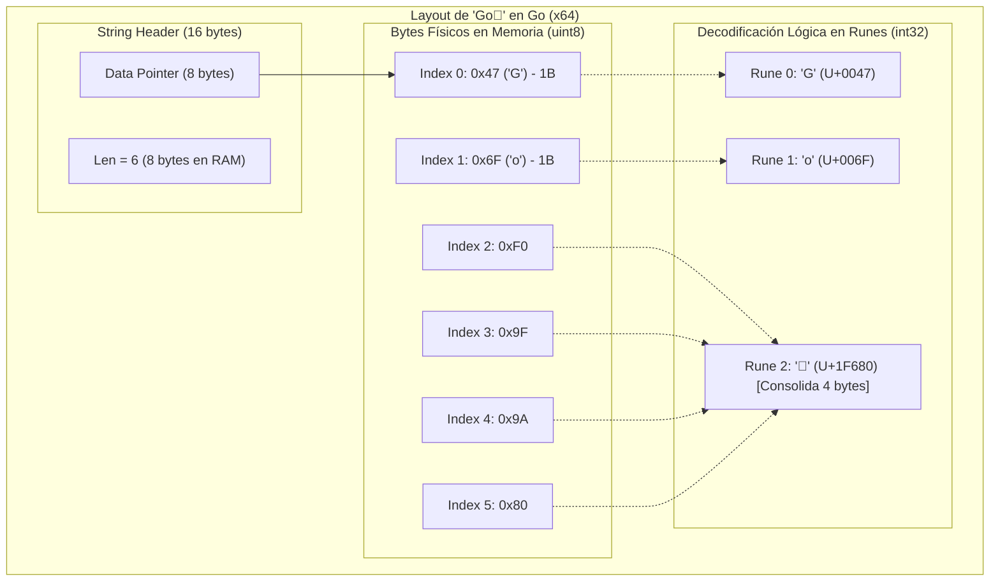
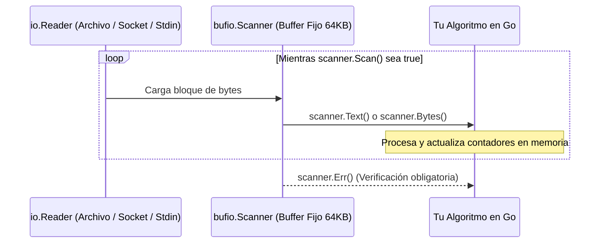

# 📖 Lección 01: `byte` vs. `rune`, Memoria UTF-8 y Streaming con `bufio.Scanner`

> **Nivel:** 1 (Fundamentos & Go Idiomático)  
> **Módulo:** `01-basics`  
> **Ejercicio:** `01-word-frequency`  
> **Objetivo:** Dominar el layout de memoria de strings en Go, diferenciación estricta entre bytes y runes, iteración sobre UTF-8 y lectura eficiente en streaming sin saturación de memoria.

---

## 🎯 1. Fundamentos Teóricos: La Física de los Strings en Go

### A. La Trampa de Java y JavaScript
* En **Java**, un `String` histórico está basado en arrays de `char` de 16 bits (UTF-16).
* En **JavaScript**, los strings se indexan por unidades de código UTF-16 de 16 bits (`str.length`), lo que provoca anomalías con emojis y caracteres multibyte complejos.
* En **Go**, un `string` es en realidad una estructura de datos inmutable de **dos palabras máquina (16 bytes en arquitecturas x64)**:
  1. Un puntero al array de bytes subyacente (`Data uintptr`).
  2. La longitud exacta medida estrictamente en **bytes** (`Len int`).

### B. `byte` vs. `rune`
* **`byte`:** Alias de `uint8` (8 bits, 1 byte). Representa almacenamiento crudo de bytes binarios (ASCII tradicional de 0 a 127).
* **`rune`:** Alias de `int32` (32 bits, 4 bytes). Representa un **Unicode Code Point** individual según el estándar universal ISO/IEC 10646.

Dado que **UTF-8 es una codificación de longitud variable (1 a 4 bytes por símbolo)**:
* Los caracteres ASCII en inglés (`'A'`, `'z'`, `'1'`) ocupan **1 byte**.
* Las letras del español con tildes y eñes (`'ñ'`, `'á'`, `'é'`) ocupan **2 bytes**.
* Símbolos matemáticos y alfabetos asiáticos (`'€'`, `'文'`) ocupan **3 bytes**.
* Emojis y símbolos extendidos (`'🚀'`, `'🔥'`, `'🧠'`) ocupan **4 bytes**.

---

## 🧠 2. Diagrama de Memoria: ¿Qué Pasa en la RAM?

Si declaramos en Go la cadena `"Go🚀"`:



### Reglas Críticas del Compilador:
1. `len("Go🚀")` retorna **6** (porque cuenta bytes físicos).
2. `utf8.RuneCountInString("Go🚀")` retorna **3** (porque decodifica los Code Points).
3. `s[2]` accede al byte crudo `0xF0`, **no al emoji**. Tratar de imprimir `s[2]` como carácter mostrará basura o símbolos de reemplazo (``).
4. El bucle `for idx, r := range s` invoca internamente la decodificación de `utf8.DecodeRuneInString`, entregando el offset del primer byte y la `rune` (`int32`) completa.

---

## 🌊 3. Streaming Eficiente con `bufio.Scanner`

En microservicios o herramientas CLI, leer un archivo completo a memoria con `os.ReadFile` es un antipatrón que provoca picos de memoria RAM (OOM Kills en Cloud Run 512 MiB).

`bufio.Scanner` resuelve esto implementando el patrón **Iterator/Streamer**:
* Mantiene un buffer interno reciclable (por defecto de 64 KiB).
* Lee del `io.Reader` subyacente en bloques.
* Utiliza una función de división (`SplitFunc`), como `bufio.ScanLines` (por defecto) o `bufio.ScanWords`, entregando tokens individuales sin realocar el documento completo.



---

## 💡 4. Ejemplo Ilustrativo (Dominio Desacoplado: Telemetría de Satélite)

> *Nota: Este ejemplo ilustra la mecánica de runes y buffers, pero aplica a un dominio satelital para no resolver tu ejercicio.*

```go
package main

import (
	"bufio"
	"fmt"
	"strings"
	"unicode"
	"unicode/utf8"
)

func main() {
	// Simulación de un stream de telemetría con símbolos Unicode
	telemetryStream := "ORBITA: OK [Alt: 420km] 📡 Temp: -15°C 🛰️ STATUS: Estación_Alpha"

	scanner := bufio.NewScanner(strings.NewReader(telemetryStream))
	// Tokenizar por palabras
	scanner.Split(bufio.ScanWords)

	fmt.Println("=== Procesando Tokens de Telemetría ===")
	for scanner.Scan() {
		word := scanner.Text()
		runeCount := utf8.RuneCountInString(word)
		byteCount := len(word)

		// Inspeccionar caracteres no ASCII (símbolos y emojis)
		var specialSymbols []rune
		for _, r := range word {
			if !unicode.IsLetter(r) && !unicode.IsNumber(r) && !unicode.IsPunct(r) {
				specialSymbols = append(specialSymbols, r)
			}
		}

		fmt.Printf("Token: %-15s | Bytes: %2d | Runes: %2d | Símbolos Especiales: %c\n",
			word, byteCount, runeCount, specialSymbols)
	}

	if err := scanner.Err(); err != nil {
		fmt.Printf("Error leyendo stream: %v\n", err)
	}
}
```

---

## 🧠 5. Pregunta de Control Feynman

Antes de empezar a codificar, responde a esta pregunta en tus propias palabras:

> *Si en Go declaras `texto := "Golang en Español"` y accedes a `texto[13]`, ¿qué obtendrás en pantalla? ¿La letra `'ñ'` o algo distinto? ¿Por qué `utf8.RuneCountInString(texto)` da un número diferente a `len(texto)`?*

---

## 🛠️ 6. Especificación del Reto Técnico

Debes implementar tu solución en esta carpeta:
* `counter.go`: Funciones de procesamiento de frecuencias.
* `counter_test.go`: Suite de pruebas unitarias basadas en tablas.
* `main.go`: Punto de entrada CLI que lea de `os.Stdin` o argumentos.

### Requerimientos Funcionales:
1. **`WordFrequency(r io.Reader) (map[string]int, error)`**:
   - Leer el contenido en streaming usando `bufio.Scanner` configurado con `bufio.ScanWords`.
   - Normalizar palabras: convertir a minúsculas (`strings.ToLower`) y limpiar signos de puntuación periféricos (comas, puntos, signos de interrogación).
   - Contar apariciones de cada palabra.
2. **`CharFrequency(r io.Reader) (map[rune]int, error)`**:
   - Contar la frecuencia de cada carácter Unicode (`rune`), preservando acentos (`á`, `é`), eñes y emojis.
   - Ignorar espacios en blanco y saltos de línea (`unicode.IsSpace`).
3. **`SortedKeys[K constraints.Ordered, V any](m map[K]V) []K`** (o funciones separadas para string y rune):
   - Extraer las llaves del mapa a un slice y ordenarlas alfabéticamente/numéricamente antes de imprimirlas (los maps en Go no tienen orden determinista).

### Requerimientos de Calidad:
* Ejecutar y pasar:
  ```bash
  go test -v -race ./...
  ```
* Incluir al menos 3 casos en tus Table-Driven Tests:
  1. Texto estándar en español con tildes y eñes (`"El pingüino subió al avión en Bogotá"`).
  2. Texto con emojis y signos de puntuación (`"¡Hola, mundo! 🚀 Go es rápido... 🚀"`).
  3. Entrada vacía o compuesta únicamente de espacios en blanco (`"    \n\t  "`).

---

## 📊 7. Rúbrica de Evaluación (Objetivo: $\ge 90\%$)

| Criterio | Puntos | Qué se Evalúa |
| :--- | :---: | :--- |
| **1. Corrección & Casos Borde** | 30 pts | Manejo correcto de UTF-8, emojis, acentos y streams vacíos. |
| **2. Idiomaticidad de Go** | 25 pts | Uso de `io.Reader`, chequeo obligatorio de `scanner.Err()`, nombres limpios y `gofmt`. |
| **3. Layout de Memoria & Allocs** | 20 pts | Uso de buffers reutilizables, sin conversiones redundantes `[]byte` a `string`. |
| **4. Pruebas Unitarias & Race Detector** | 15 pts | Table-driven tests completos, ejecutados con `-race` sin advertencias. |
| **5. Diseño & Ordenamiento Determinista** | 10 pts | Algoritmo determinista para extraer y ordenar llaves de maps. |
